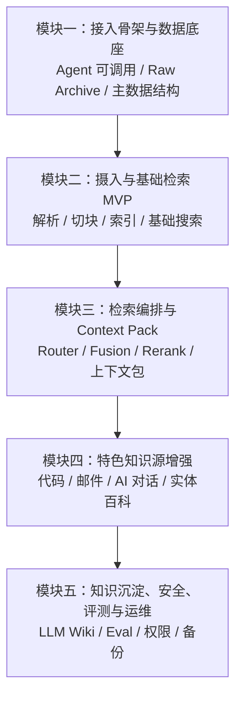

# 个人知识上下文服务设计文档

> 项目暂定名：**Personal Knowledge Context Server**  
> 简称：**PKCS**  
> 中文名：**个人知识上下文服务**  
> 文档版本：v0.1  
> 目标读者：项目设计者、实现者、未来接入 Claude Code / Codex / OpenClaw / 其他 Agent 的使用者

---

## 0. 文档目的

本文档用于把“个人知识库 + 外部 Agent 调用 + 上下文注入”的整体想法，整理成一套可执行的设计方案。

这个项目的核心目标不是做一个新的知识库聊天机器人，而是做一个可以被外部 Agent 调用的个人长期知识基础设施。

换句话说，它不是：

```text
用户 → 知识库聊天应用 → 知识库 Agent 自己回答
```

而是：

```text
Claude Code / Codex / OpenClaw / 其他 Agent
        ↓
调用个人知识库工具
        ↓
个人知识上下文服务检索、筛选、压缩、引用资料
        ↓
返回 Context Pack
        ↓
主 Agent 使用这些上下文继续完成当前任务
```

因此，本项目的核心产物不是聊天 UI，而是一组稳定、可追溯、可扩展的工具接口。

---

# 1. 总设计

## 1.1 项目定位

本系统定位为：

> **面向外部 Agent 的个人知识库后端服务。**

它主要服务于：

```text
Claude Code
Codex
OpenClaw
IDE Agent
本地 Agent
自动化脚本
未来自定义工作流
```

它对外提供的不是“最终智能回答”，而是：

```text
检索结果
原文证据
上下文材料包
历史记忆
项目资料
代码片段
实体信息
引用来源
```

主 Agent 拿到这些资料后，再根据当前任务进行推理、编码、写作、分析或决策。

---

## 1.2 系统边界

### 本系统负责

```text
1. 保存原始资料
2. 解析资料
3. 切分 chunk
4. 建立检索索引
5. 根据问题选择检索路径
6. 多路召回资料
7. 重排候选结果
8. 读取原始证据
9. 压缩成 Context Pack
10. 返回给外部 Agent
11. 后续沉淀高价值知识
```

### 本系统不负责，至少第一阶段不负责

```text
1. 替主 Agent 做最终决策
2. 自动修改项目代码
3. 自动发送邮件
4. 自动执行 shell 命令
5. 自动把所有推理写入长期记忆
6. 替代 Claude Code / Codex / OpenClaw
7. 做完整聊天产品
8. 做复杂多 Agent 自治系统
```

本系统应该保持克制：

> **它是知识服务，不是主 Agent。**

---

## 1.3 总体架构

```text
┌─────────────────────────────────────────────┐
│ 外部主 Agent                                │
│ Claude Code / Codex / OpenClaw / 其他 Agent │
│                                             │
│ 职责：                                      │
│ - 完成当前用户任务                           │
│ - 决定是否调用知识库                         │
│ - 使用返回的上下文继续推理                   │
└───────────────────┬─────────────────────────┘
                    │
                    │ MCP / HTTP / CLI Adapter
                    ↓
┌─────────────────────────────────────────────┐
│ Personal Knowledge Context Server            │
│                                             │
│ 对外工具层：                                │
│ - search_knowledge                          │
│ - search_code                               │
│ - search_memory                             │
│ - read_source                               │
│ - get_context_pack                          │
│ - get_entity                                │
│ - ingest_source                             │
└───────────────────┬─────────────────────────┘
                    │
                    ↓
┌─────────────────────────────────────────────┐
│ 检索编排层                                  │
│                                             │
│ - Query Router                              │
│ - Source Type Router                        │
│ - Multi-Retriever                           │
│ - Alias / Entity Expansion                  │
│ - Fusion                                    │
│ - Reranker                                  │
│ - Context Packer                            │
└───────────────────┬─────────────────────────┘
                    │
                    ↓
┌─────────────────────────────────────────────┐
│ 检索与索引层                                │
│                                             │
│ - 全文检索                                  │
│ - 向量检索                                  │
│ - 代码检索                                  │
│ - 邮件 thread 检索                          │
│ - AI 对话记忆检索                           │
│ - Wiki / Entity 检索                        │
└───────────────────┬─────────────────────────┘
                    │
                    ↓
┌─────────────────────────────────────────────┐
│ 数据与知识层                                │
│                                             │
│ - Raw Archive 原始资料                       │
│ - PostgreSQL 主数据                          │
│ - Search Index 搜索索引                      │
│ - Parsed Text / Chunks                      │
│ - Citations                                 │
│ - LLM Wiki                                  │
│ - Entities / Aliases / Relations            │
└─────────────────────────────────────────────┘
```

---

## 1.4 核心工作流

### 1.4.1 资料摄入流程

```text
资料进入
    ↓
保存到 Raw Archive
    ↓
计算 hash 与版本号
    ↓
识别 source_type
    ↓
解析文本与元数据
    ↓
按资料类型切 chunk
    ↓
写入 PostgreSQL
    ↓
写入 Search Index
    ↓
生成引用信息
    ↓
可选：生成 summary / entity / memory
```

---

### 1.4.2 Agent 查询流程

```text
外部 Agent 提出问题
    ↓
调用 search_knowledge / get_context_pack
    ↓
Query Router 判断问题类型
    ↓
选择数据源与检索器
    ↓
多路召回
    ↓
结果融合
    ↓
rerank
    ↓
必要时 read_source 读取原文
    ↓
压缩成 Context Pack
    ↓
返回给主 Agent
```

---

### 1.4.3 Context Pack 流程

`Context Pack` 是本系统最核心的输出。

它不是普通搜索结果列表，而是一个可直接注入主 Agent 上下文的材料包。

```text
检索候选
    ↓
去重
    ↓
重排
    ↓
读取关键原文
    ↓
归纳证据
    ↓
标记冲突和不确定点
    ↓
压缩到 token budget 内
    ↓
返回带引用的上下文包
```

---

## 1.5 核心设计原则

### 原则一：主 Agent 是主角，知识库是工具

知识库服务不应该抢主 Agent 的任务控制权。

它应该返回：

```text
我找到了什么
为什么相关
证据在哪里
这些资料是否冲突
哪些内容可能过时
主 Agent 可以继续读哪些 source
```

而不是默认返回最终决策。

---

### 原则二：Raw Archive 永远保留

所有资料都应先进入原始资料层。

原始资料层尽量只追加，不覆盖。

每份资料至少有：

```text
source_id
version_id
content_hash
source_type
origin_uri
imported_at
status
file_path
```

如果同一文档有新版本，旧版本也保留。

这样可以保证：

```text
1. 历史判断可追溯
2. 新旧版本可对比
3. 错误可以回滚
4. 上下文包有证据来源
```

---

### 原则三：检索必须类型感知

你的知识库不是单一文档库，而是大杂烩：

```text
游戏 wiki
GitHub 源码
工作业务知识
个人项目
AI 对话
邮件
公开 AI 工具文档
番剧百科
二次元人物百科
游戏攻略
网页资料
PDF
Markdown
```

因此，不应该每次都做全库 embedding top-k。

正确方式是：

```text
先判断该去哪找
再决定怎么找
最后重排和压缩
```

---

### 原则四：接口先于内部实现

外部 Agent 不应该关心你内部用的是：

```text
OpenSearch
PostgreSQL FTS
pgvector
Qdrant
SQLite
Meilisearch
Neo4j
```

它只应该看到稳定工具：

```text
search_knowledge
search_code
read_source
get_context_pack
get_entity
search_memory
```

因此，要先定义工具接口，再替换内部检索实现。

---

### 原则五：LLM Wiki 和 Graph 后置

第一阶段不要直接追求完整 LLM Wiki 或 GraphRAG。

先完成：

```text
可接入
可摄入
可检索
可引用
可返回 Context Pack
```

后续再增强：

```text
source summary
project memory
decision record
belief history
concept page
entity relation
alias expansion
```

---

# 2. 总路线图

## 2.1 五阶段路线

整个项目分为五个大模块：

```text
M1：接入骨架与数据底座
        ↓
M2：摄入与基础检索 MVP
        ↓
M3：检索编排与 Context Pack
        ↓
M4：特色知识源增强
        ↓
M5：知识沉淀、安全、评测与运维
```

用更直观的话说：

```text
M1：让 Agent 能调用你的知识库
M2：让知识库能吃资料、能搜资料
M3：让它搜得准，并返回可用上下文
M4：让它理解不同资料类型的特殊结构
M5：让它长期可靠、安全、可演进
```

---

## 2.2 总路线图表

| 模块 | 目标 | 核心产物 | 验收重点 |
|---|---|---|---|
| M1 接入骨架与数据底座 | Agent 能调用，资料能保存 | MCP/API、Raw Archive、PostgreSQL | 工具可调用、原文可追溯、版本不覆盖 |
| M2 摄入与基础检索 MVP | 各类资料能导入和搜索 | ingest pipeline、chunks、search v1 | 多类型资料导入、top 5/top 10 初步命中 |
| M3 检索编排与 Context Pack | 搜得准，返回可用上下文 | router、fusion、rerank、context pack | 主 Agent 能基于 context pack 完成任务 |
| M4 特色知识源增强 | 对不同资料类型专项优化 | code/email/memory/entity 检索 | 代码、邮件、AI 对话、百科分别可用 |
| M5 知识沉淀、安全、评测与运维 | 长期可信、可恢复、可进化 | LLM Wiki、eval、权限、备份 | 防污染、可回归测试、可迁移恢复 |

---

## 2.3 推荐推进顺序

### 第一阶段：M1 + M2

目标：做出最小可用个人知识库服务。

完成后应该能：

```text
导入资料
搜索资料
读回原文
被 Agent 调用
返回基础结果
```

不要在这一阶段纠结：

```text
Graph
完整 LLM Wiki
复杂 reranker
复杂 UI
全自动记忆更新
```

---

### 第二阶段：M3

目标：让知识库真正成为 Agent 的上下文供应器。

完成后应该能：

```text
Claude Code / Codex / OpenClaw 调用 get_context_pack
系统自动检索相关资料
系统返回压缩后的上下文材料包
主 Agent 基于材料包继续完成任务
```

这是项目价值真正出现的阶段。

---

### 第三阶段：M4

目标：针对你的个人资料类型做专项优化。

完成后系统才会明显区别于普通 RAG。

它应该能更好处理：

```text
代码
AI 对话
邮件
个人项目
工作业务知识
游戏 wiki
番剧百科
二次元人物
官方文档
```

---

### 第四阶段：M5

目标：长期可信、长期演进。

完成后它不只是检索工具，而是个人长期知识基础设施。

---

# 3. 大模块规划图

## 3.1 ASCII 规划图

```text
┌─────────────────────────────────────────────┐
│ M1. 接入骨架与数据底座                       │
│                                             │
│ 目标：系统能跑起来，Agent 能调用              │
│ 产物：MCP Server / API / PostgreSQL / Raw    │
└───────────────────┬─────────────────────────┘
                    ↓
┌─────────────────────────────────────────────┐
│ M2. 摄入与基础检索 MVP                       │
│                                             │
│ 目标：资料能导入、解析、切块、索引、搜索       │
│ 产物：ingest pipeline / chunks / search v1   │
└───────────────────┬─────────────────────────┘
                    ↓
┌─────────────────────────────────────────────┐
│ M3. 检索编排与 Context Pack                  │
│                                             │
│ 目标：不同问题走不同检索路径，输出上下文包     │
│ 产物：router / fusion / rerank / context pack│
└───────────────────┬─────────────────────────┘
                    ↓
┌─────────────────────────────────────────────┐
│ M4. 特色知识源增强                           │
│                                             │
│ 目标：代码、邮件、AI 对话、游戏 wiki 等分别优化│
│ 产物：code search / memory / entities        │
└───────────────────┬─────────────────────────┘
                    ↓
┌─────────────────────────────────────────────┐
│ M5. 知识沉淀、安全、评测与运维                │
│                                             │
│ 目标：长期可用、可评测、可恢复、可防污染       │
│ 产物：LLM Wiki / eval / backup / permissions │
└─────────────────────────────────────────────┘
```

---

## 3.2 Mermaid 规划图



---

# 4. 模块一：接入骨架与数据底座

## 4.1 模块目标

这一阶段的目标不是追求检索效果，而是先把系统边界搭清楚。

模块一完成后，应当具备：

```text
1. 外部 Agent 能调用知识库服务
2. 资料能保存进 Raw Archive
3. 主数据能记录 source / version / chunk / citation
4. 原文能通过 read_source 读回
5. 服务能本地或服务器部署
```

---

## 4.2 核心组件

### 4.2.1 MCP Server / HTTP API

第一版对外暴露：

```text
health_check
search_knowledge
read_source
get_context_pack
ingest_source
```

其中 `get_context_pack` 第一版可以很简单，只需要调用基础搜索并返回整理后的结果。

---

### 4.2.2 Raw Archive

建议目录结构：

```text
/data/raw/
  documents/
  web/
  github/
  emails/
  ai_chats/
  game_wiki/
  anime_wiki/
  attachments/
```

每份资料都要有：

```text
source_id
version_id
content_hash
file_path
source_type
origin_uri
imported_at
status
```

---

### 4.2.3 PostgreSQL 主数据

第一版核心表：

```text
sources
source_versions
documents
chunks
citations
ingest_jobs
```

建议从一开始就区分：

```text
source_id：同一个资料对象
version_id：这个资料的某个版本
chunk_id：某个版本里的某个切片
```

---

### 4.2.4 Search Provider 抽象层

不要让业务逻辑直接绑定某个搜索引擎。

建议定义抽象接口：

```text
SearchProvider.search(query, filters, top_k)
SearchProvider.index(chunks)
SearchProvider.delete(source_id / version_id)
SearchProvider.health()
```

这样第一版可以轻量实现，未来可以切换到 OpenSearch、pgvector、Qdrant 或其他后端。

---

## 4.3 技术建议

如果有 32GB 以上本地服务器或云服务器：

```text
PostgreSQL + OpenSearch
```

如果只有 16GB 主力电脑：

```text
PostgreSQL + 轻量全文/向量索引
```

但无论内部实现是什么，对外工具接口都应保持稳定。

---

## 4.4 模块一验收标准

### A. 接入验收

```text
1. 外部 Agent 可以调用 health_check。
2. 外部 Agent 可以调用 search_knowledge。
3. 外部 Agent 可以调用 read_source。
4. 工具返回结构稳定，不是随意自然语言。
```

示例返回结构：

```json
{
  "result_id": "chunk_123",
  "source_id": "src_001",
  "version_id": "v1",
  "title": "example",
  "source_type": "ai_conversation",
  "snippet": "...",
  "citation": {
    "locator": "line 12-20"
  }
}
```

### B. 数据验收

```text
1. 导入同一份资料两个版本时，旧版本不会被覆盖。
2. 每个 chunk 都能追溯到 source_id 和 version_id。
3. read_source 能根据 citation 找回原文。
4. 删除索引不删除 raw archive。
```

### C. 部署验收

```text
1. 可以通过 Docker Compose 启动。
2. 服务重启后数据不丢。
3. 有基本日志。
4. 有本地备份目录。
```

---

# 5. 模块二：摄入与基础检索 MVP

## 5.1 模块目标

这一阶段目标是让系统能真正吃进你的资料，并完成基础检索闭环。

覆盖资料类型包括：

```text
AI 对话
Markdown / 文档
网页 / wiki
GitHub 项目源码
邮件
工作资料
游戏攻略 / 百科
官方 API 文档
番剧 / 人物百科
```

第一版不要求每类都完美。

先达到：

```text
能解析
能分类
能切块
能索引
能搜索
能返回引用
```

---

## 5.2 标准摄入流程

```text
ingest_source
    ↓
保存 raw 文件
    ↓
计算 hash
    ↓
识别 source_type
    ↓
解析文本
    ↓
抽取 metadata
    ↓
切 chunk
    ↓
写 PostgreSQL
    ↓
写 Search Index
    ↓
返回 ingest report
```

---

## 5.3 资料类型处理策略

### 5.3.1 普通文档 / 网页 / Wiki

需要保存：

```text
title
headings
url
section_path
content
created_at
updated_at
source_type
```

chunk 策略：

```text
按标题层级切
保留 heading_path
不要只用固定长度硬切
```

---

### 5.3.2 GitHub 源码

第一版保存：

```text
repo
branch
commit
file_path
language
content
```

代码 chunk 初期可以按：

```text
文件
函数
类
短片段
```

后续再引入语法级切分。

---

### 5.3.3 AI 对话

AI 对话不要只存原始 turns。

第一版至少需要：

```text
conversation_title
participants
topic_tags
turns
summary
decisions
open_questions
```

这样未来才能回答：

```text
我之前为什么做这个决定？
我和 AI 讨论过这个问题吗？
我当时的结论是什么？
```

---

### 5.3.4 邮件

邮件需要保存：

```text
thread_id
subject
from
to
cc
date
attachments
body
```

第一版最好按 thread 聚合，而不是只按单封邮件搜索。

---

### 5.3.5 游戏 / 番剧 / 二次元百科

这一类资料重点是实体与别名。

第一版保存：

```text
title
aliases
work_name
character_name
game_name
version
category
content
```

`aliases` 非常重要。

---

## 5.4 基础检索能力

第一版至少支持：

```text
关键词搜索
标题搜索
source_type filter
project filter
时间过滤
top_k 返回
read_source 追溯
```

向量检索可以做，但不要把它作为唯一入口。

---

## 5.5 模块二验收标准

### A. 验收语料库

准备一个小型验收语料库：

```text
1 个 GitHub 项目
10 篇 AI 对话
20 篇普通文档 / 网页
20 条游戏 / 番剧百科
20 封邮件或 5 个邮件 thread
若干工作资料 / 项目资料
```

---

### B. 摄入验收

```text
1. 每类资料都能成功导入。
2. 每个 source 都有 source_type。
3. 每个 chunk 都有 source_id、version_id、locator。
4. 重复导入相同文件不会产生脏重复。
5. 新版本导入后，旧版本仍保留。
```

---

### C. 搜索验收

构造 30 个测试问题，例如：

```text
我之前和 AI 讨论过 RAG 和 Graph 的地方在哪？
某个 GitHub 项目的配置文件在哪里？
某封关于项目进度的邮件在哪个 thread？
某游戏角色的攻略在哪里？
某个 API 文档里有没有提到这个参数？
```

要求：

```text
1. 目标资料出现在 top 10。
2. 至少 70% 的测试问题，目标资料出现在 top 5。
3. 搜索结果必须带引用。
4. read_source 能读回正确原文。
```

---

### D. 性能验收

```text
普通 search_knowledge：3 秒内返回
read_source：1 秒内返回
小规模 ingest：稳定完成，不丢数据
```

---

# 6. 模块三：检索编排与 Context Pack

## 6.1 模块目标

这一阶段是项目核心价值出现的阶段。

目标是从：

```text
搜出来一堆结果
```

升级为：

```text
根据问题类型选择检索路径，返回主 Agent 可直接使用的上下文包
```

---

## 6.2 Query Router

Query Router 接收用户问题，输出检索计划。

示例：

```json
{
  "intent": "personal_memory",
  "source_types": ["ai_conversation", "project_doc", "wiki_page"],
  "retrievers": ["keyword", "semantic", "memory_summary"],
  "need_code": false,
  "need_email": false,
  "need_recent": false,
  "need_exact": false,
  "budget_tokens": 3000
}
```

常见 intent：

```text
code_lookup
project_memory
personal_memory
email_lookup
game_guide
anime_entity
official_doc_lookup
work_knowledge
general_research
```

---

## 6.3 Multi-Retriever

不同问题走不同检索器：

```text
关键词检索
语义检索
标题 / alias 检索
代码 path / symbol 检索
邮件 thread 检索
AI 对话 summary 检索
wiki page 检索
entity expansion
```

不要每次全库乱搜。

---

## 6.4 Fusion + Rerank

召回阶段追求不要漏。

示例：

```text
关键词 top 30
向量 top 30
标题 / alias top 20
记忆 summary top 20
代码搜索 top 20
```

然后：

```text
融合
去重
重排
保留 top 8 ~ top 20
```

---

## 6.5 Context Pack 格式

建议 `get_context_pack` 输出稳定 Markdown 或 JSON + Markdown 混合结构。

示例：

```markdown
# Context Pack

## Query

用户原始问题

## Retrieval Plan

本次检索使用了哪些数据源和检索器。

## High-Level Answer Hints

给主 Agent 的简短提示，不替主 Agent 最终回答。

## Evidence

### [1] 标题

- source_type:
- source_id:
- version_id:
- locator:
- relevance:
- snippet:

### [2] 标题

...

## Conflicts / Caveats

哪些资料可能冲突、过时、不确定。

## Suggested Next Reads

主 Agent 如果需要严谨，可以继续 read_source 的引用。
```

---

## 6.6 模块三验收标准

### A. 准确率验收

构造 50 个测试问题，覆盖：

```text
代码
邮件
游戏攻略
AI 对话
工作知识
个人项目
官方文档
番剧 / 人物百科
```

要求：

```text
1. 至少 80% 的测试问题，正确资料进入 top 5。
2. 至少 90% 的测试问题，正确资料进入 top 10。
3. Context Pack 中至少 80% 的引用确实支持对应摘要。
4. 不允许出现没有 source_id 的证据。
```

---

### B. 上下文质量验收

人工抽查 20 个 context pack：

```text
1. 主 Agent 读完后能明确知道哪些资料最重要。
2. 每个关键结论都有引用。
3. 不同来源的冲突会被标出来。
4. 不把旧资料伪装成当前事实。
5. 不把 AI 对话里的猜测伪装成官方文档。
```

---

### C. Agent 接入验收

至少接入一个真实前台 Agent。

要求：

```text
1. 主 Agent 能调用 search_knowledge。
2. 主 Agent 能调用 read_source。
3. 主 Agent 能调用 get_context_pack。
4. 主 Agent 能基于 context pack 完成一次真实任务。
```

验收任务示例：

```text
根据我之前和 AI 的讨论，帮我继续设计个人知识库架构。
```

主 Agent 应该能自动调用你的知识库，而不是让你手动复制粘贴历史资料。

---

# 7. 模块四：特色知识源增强

## 7.1 模块目标

前三个模块完成后，系统已经能用。

第四模块的目标是让它对你的大杂烩资料真正有区分能力。

重点增强：

```text
代码
AI 对话
邮件
个人项目
游戏 / 番剧 / 二次元百科
官方 AI 工具文档
工作业务知识
```

---

## 7.2 代码增强

第一阶段代码只是文本搜索。

这一阶段升级为：

```text
repo-aware
path-aware
symbol-aware
language-aware
commit-aware
```

新增工具：

```text
search_code
read_code
find_symbol
```

代码结果必须返回：

```text
repo
branch / commit
file_path
line_range
symbol
snippet
```

---

## 7.3 AI 对话记忆增强

AI 对话不要只做原文检索。

需要生成：

```text
conversation_summary
decision_records
belief_changes
open_questions
project_links
```

例如一段关于个人知识库的讨论，可以沉淀为：

```text
主题：个人知识库作为 Agent 可调用的上下文服务
旧判断：可能要做完整知识库 Agent
新判断：应该做 MCP Personal Knowledge Context Server
关键结论：Context Pack 是核心产物
```

新增工具：

```text
search_memory
get_decisions
get_belief_history
```

---

## 7.4 邮件增强

邮件要支持：

```text
thread summary
participants
attachments
date range
decision extraction
```

搜索结果优先返回 thread，而不是单封碎片邮件。

---

## 7.5 游戏 / 番剧 / 百科增强

这类资料核心是实体和别名。

需要建立：

```text
entities
aliases
works
relations
versions
categories
```

例如：

```text
角色 A
别名：中文名、日文名、昵称、玩家简称
作品：某番剧 / 某游戏
相关角色：B、C
相关攻略：...
```

新增工具：

```text
get_entity
search_entity
entity_expand_search
```

---

## 7.6 官方 AI 文档增强

OpenAI / Anthropic / Google 等公开文档要特别处理：

```text
provider
product
api_name
doc_url
section_path
last_crawled_at
version
deprecated_status
```

这类资料回答时要优先最新官方来源，不要优先使用旧聊天记录。

---

## 7.7 工作业务知识增强

工作业务知识重点不是纯语义，而是：

```text
项目
客户
流程
决策
责任人
时间
权限
版本
是否废弃
```

需要支持：

```text
project filter
business term search
decision log search
recent/current boost
official/internal boost
```

---

## 7.8 模块四验收标准

### A. 代码验收

```text
1. 用函数名能找到对应文件和行号。
2. 用报错片段能找到相关实现或配置。
3. 用模块名能找到 README / docs / source。
4. 返回结果包含 repo、path、line_range。
```

---

### B. AI 对话记忆验收

```text
1. 能找回某次关键讨论。
2. 能说明当时形成了什么结论。
3. 能区分“当时的想法”和“当前沉淀后的判断”。
4. 能找到某个项目的历史决策。
```

---

### C. 邮件验收

```text
1. 可以按人、主题、时间找到 thread。
2. 可以返回 thread summary。
3. 附件能被关联。
4. 不把同一 thread 的碎片邮件重复刷屏。
```

---

### D. 游戏 / 番剧 / 实体验收

```text
1. 用别名能找到 canonical entity。
2. 用中文名 / 日文名 / 英文名能互相映射。
3. 能找到相关攻略 / 设定 / 关系。
4. 能区分不同作品中同名角色。
```

---

### E. 官方文档验收

```text
1. 能优先返回官方文档。
2. 能标出文档更新时间 / 抓取时间。
3. 能识别 deprecated / old version。
4. 对 API 类问题，不优先引用旧聊天记录。
```

---

### F. 工作业务知识验收

```text
1. 能按项目找到相关资料。
2. 能找到历史决策依据。
3. 能区分旧流程和当前流程。
4. 能对敏感资料做权限隔离。
```

---

# 8. 模块五：知识沉淀、安全、评测与运维

## 8.1 模块目标

这个模块让系统从“能用”变成“长期可信”。

包括：

```text
LLM Wiki
知识沉淀
评测集
反馈闭环
权限控制
防污染
备份恢复
资源控制
监控
```

---

## 8.2 LLM Wiki 层

当检索和 Context Pack 稳定后，再引入知识沉淀层。

生成：

```text
source summaries
concept pages
project pages
decision records
belief history
contradiction logs
```

这些页面主要服务于：

```text
长期项目记忆
反复被问的问题
你和 AI 的关键讨论
个人判断变化
复杂概念综合
```

---

## 8.3 知识沉淀层的形态

建议以 Markdown/Wiki 为主：

```text
/wiki/
  index.md
  concepts/
  sources/
  projects/
  decisions/
  beliefs/
  contradictions/
  logs/
```

知识沉淀层不是向量，也不是图数据库。

它的主形态应该是：

```text
可读 Markdown
标准模板
引用
链接
日志
版本历史
```

向量、全文索引、graph 都只是它的派生索引或关系视图。

---

## 8.4 权限与防污染

默认所有外部 Agent 只能读，不能写。

写入工具需要单独权限：

```text
ingest_source
write_memory
update_wiki
```

建议写入分三类：

```text
raw ingest：允许，但记录来源
memory proposal：待审核
wiki update：待审核或人工确认
```

防止一次错误推理污染长期知识库。

---

## 8.5 评测集

建立自己的检索评测集。

评测集结构：

```text
query
expected_source_ids
expected_source_types
must_not_sources
notes
```

示例：

```json
{
  "query": "我之前为什么认为知识库不该直接做图数据库？",
  "expected_source_types": ["ai_conversation", "wiki_page"],
  "expected_source_ids": ["..."],
  "must_not_sources": ["game_wiki", "anime_wiki"]
}
```

每次改检索策略，都跑评测。

---

## 8.6 运维与资源控制

需要控制：

```text
索引大小
内存占用
embedding worker 并发
reranker 并发
ingest 频率
备份
恢复
日志
```

建议：

```text
白天只查询
晚上批量 ingest
本地电脑轻量运行
重任务放服务器
```

---

## 8.7 模块五验收标准

### A. 知识沉淀验收

```text
1. 至少 20 个高价值 AI 对话被沉淀成 memory / wiki 页面。
2. 至少 5 个个人项目有 project memory 页面。
3. 至少 10 个关键决策有 decision record。
4. 每个 wiki 页面都能追溯到 source / conversation / citation。
```

---

### B. 安全验收

```text
1. 默认所有 Agent 只能读，不能写。
2. 写入长期记忆需要显式权限。
3. API key / 邮件 / 私密资料不会被默认暴露给所有工具。
4. 每次写入都有 audit log。
5. 可以撤销一次错误写入。
```

---

### C. 评测验收

```text
1. 至少 100 条个人知识库检索测试问题。
2. 每次检索策略修改都能跑回归测试。
3. top 5 命中率不低于既有版本。
4. context pack 引用准确率经过人工抽查。
```

---

### D. 运维验收

```text
1. 一键启动。
2. 一键备份。
3. 一键恢复到新机器。
4. 服务异常有日志。
5. 索引损坏时可以从 PostgreSQL / raw archive 重建。
```

---

# 9. 对外工具设计草案

## 9.1 `search_knowledge`

通用搜索工具。

### 输入

```json
{
  "query": "string",
  "source_types": ["optional"],
  "project": "optional",
  "time_range": "optional",
  "top_k": 10
}
```

### 输出

```json
{
  "results": [
    {
      "result_id": "chunk_123",
      "source_id": "src_001",
      "version_id": "v1",
      "title": "...",
      "source_type": "ai_conversation",
      "snippet": "...",
      "score": 0.87,
      "why_relevant": "...",
      "citation": {
        "locator": "line 12-20"
      }
    }
  ]
}
```

---

## 9.2 `read_source`

读取原始证据。

### 输入

```json
{
  "source_id": "src_001",
  "version_id": "v1",
  "locator": "line 12-20"
}
```

### 输出

```json
{
  "source_id": "src_001",
  "version_id": "v1",
  "title": "...",
  "content": "...",
  "locator": "line 12-20"
}
```

---

## 9.3 `get_context_pack`

核心工具。

### 输入

```json
{
  "query": "string",
  "source_types": ["optional"],
  "budget_tokens": 4000,
  "include_conflicts": true,
  "include_sources": true
}
```

### 输出

```json
{
  "query": "...",
  "retrieval_plan": {...},
  "context_pack_markdown": "...",
  "sources": [...],
  "followup_read_suggestions": [...]
}
```

---

## 9.4 `search_code`

源码专用检索。

### 输入

```json
{
  "query": "string",
  "repo": "optional",
  "language": "optional",
  "path": "optional",
  "symbol": "optional",
  "top_k": 10
}
```

### 输出

```json
{
  "results": [
    {
      "repo": "my-repo",
      "branch": "main",
      "commit": "abc123",
      "file_path": "src/router.py",
      "line_range": "10-40",
      "symbol": "QueryRouter",
      "snippet": "..."
    }
  ]
}
```

---

## 9.5 `search_memory`

搜索 AI 对话、个人判断、项目决策。

### 输入

```json
{
  "query": "string",
  "project": "optional",
  "time_range": "optional",
  "include_belief_changes": true
}
```

### 输出

```json
{
  "results": [
    {
      "memory_id": "mem_001",
      "title": "个人知识库架构讨论",
      "summary": "...",
      "decisions": [...],
      "belief_changes": [...],
      "source_refs": [...]
    }
  ]
}
```

---

## 9.6 `get_entity`

实体查询工具。

### 输入

```json
{
  "name": "string",
  "entity_type": "optional"
}
```

### 输出

```json
{
  "entity_id": "ent_001",
  "canonical_name": "...",
  "aliases": [...],
  "entity_type": "character",
  "related_entities": [...],
  "source_refs": [...]
}
```

---

## 9.7 `ingest_source`

资料摄入工具。

### 输入

```json
{
  "source_type": "ai_conversation",
  "content": "...",
  "metadata": {...}
}
```

### 输出

```json
{
  "ingest_job_id": "job_001",
  "source_id": "src_001",
  "version_id": "v1",
  "status": "queued"
}
```

注意：写入工具应受到权限控制。

---

# 10. 数据模型草案

## 10.1 Source

```text
sources
- id
- title
- source_type
- origin_uri
- canonical_key
- created_at
- updated_at
- current_version_id
```

---

## 10.2 Source Version

```text
source_versions
- id
- source_id
- version_number
- file_path
- content_hash
- imported_at
- status
- supersedes_version_id
```

---

## 10.3 Chunk

```text
chunks
- id
- source_id
- version_id
- chunk_index
- heading_path
- locator
- content
- token_count
- metadata_json
- created_at
```

---

## 10.4 Citation

```text
citations
- id
- source_id
- version_id
- chunk_id
- locator
- quote
- created_at
```

---

## 10.5 Wiki Page

```text
wiki_pages
- id
- path
- title
- page_type
- markdown_content
- frontmatter_json
- created_at
- updated_at
- last_verified_at
```

---

## 10.6 Entity / Alias / Relation

```text
entities
- id
- canonical_name
- entity_type
- description
- canonical_wiki_page_id

aliases
- id
- entity_id
- alias
- language
- source_id

relations
- id
- source_entity_id
- relation_type
- target_entity_id
- evidence_source_id
- evidence_chunk_id
- confidence
- created_at
```

---

## 10.7 Memory / Decision

```text
memories
- id
- title
- memory_type
- summary
- source_refs
- project
- created_at
- updated_at

decisions
- id
- title
- decision_text
- rationale
- status
- source_refs
- created_at
```

---

# 11. 最小 MVP 范围

为了防止项目一开始过大，MVP 只做：

```text
1. MCP / HTTP 接入
2. Raw Archive
3. PostgreSQL metadata
4. 基础搜索
5. read_source
6. get_context_pack v0
7. AI 对话 ingest
8. Markdown / 网页 ingest
9. GitHub repo ingest v0
```

先不要做：

```text
复杂 Graph
Neo4j
完整 LLM Wiki
全自动知识更新
复杂 UI
邮件全量同步
本地大模型常驻
高级代码语义分析
```

MVP 的核心验收标准：

> **主 Agent 能通过你的工具找到你过去资料里的关键信息，并把它用于当前任务。**

---

# 12. 风险与应对

## 12.1 项目过度复杂化

风险：一开始就做 OpenSearch、Graph、LLM Wiki、复杂 UI、多 Agent，导致项目失控。

应对：

```text
先做 M1 + M2
只完成可调用、可摄入、可检索、可引用
Context Pack 放到 M3
LLM Wiki 放到 M5
```

---

## 12.2 检索结果不准

风险：全库搜索导致不相关资料混入。

应对：

```text
source_type filter
query router
alias/entity expansion
rerank
建立评测集
```

---

## 12.3 长期记忆污染

风险：Agent 把错误推理写入长期记忆。

应对：

```text
默认 read-only
写入待审核
所有写入有 audit log
wiki update 可撤销
```

---

## 12.4 资源占用过大

风险：本地运行 OpenSearch、embedding、reranker 占用内存和 CPU。

应对：

```text
先轻量实现
重任务放服务器
embedding worker 限流
reranker 按需运行
批量 ingest 夜间执行
```

---

## 12.5 证据不可追溯

风险：Context Pack 给出摘要但找不到来源。

应对：

```text
每个 chunk 必须有 source_id/version_id/locator
read_source 必须能读回原文
context pack 禁止无来源关键结论
```

---

# 13. 最终结论

这个项目的核心不是某个数据库、不是 OpenSearch、不是向量库、不是 BM25、不是 Graph，也不是 LLM Wiki。

它的核心是：

> **为外部 Agent 提供可信、可追溯、可压缩的个人上下文。**

因此，真正的主线应该是：

```text
外部 Agent 接入
    ↓
资料可追溯
    ↓
检索可用
    ↓
Context Pack 可用
    ↓
类型感知检索
    ↓
长期知识沉淀
```

不要反过来从技术名词出发。

第一步不是“选最强数据库”，而是：

> **定义好 Agent 怎么调用你的知识库，以及知识库返回什么格式的上下文。**

只要这个接口设计对了，后面的 OpenSearch、向量库、LLM Wiki、Graph 都可以逐步替换和增强。

---

# 14. 一句话项目定义

> **Personal Knowledge Context Server 是一个面向 Claude Code、Codex、OpenClaw 等 Agent 的个人知识库服务。它负责从你的私人资料宇宙中检索、重排、压缩、引用相关知识，并以 Context Pack 的形式交给主 Agent 使用；它本身不抢主 Agent 的决策权。**
